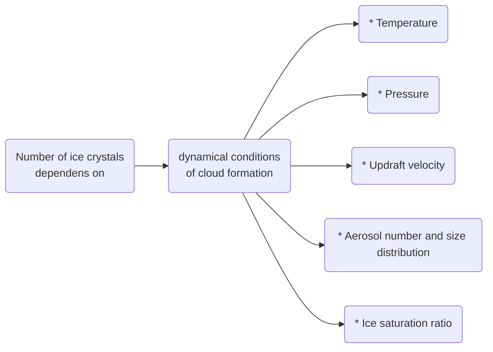
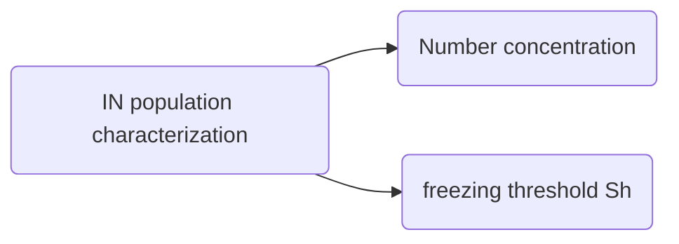
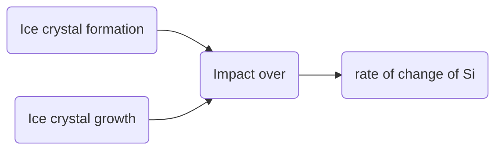

# References
@article{barahona2009parameterizing,
  title={Parameterizing the competition between homogeneous and heterogeneous freezing in cirrus cloud formation--monodisperse ice nuclei},
  author={Barahona, D and Nenes, Athanasios},
  journal={Atmospheric Chemistry and Physics},
  volume={9},
  number={2},
  pages={369--381},
  year={2009},
  publisher={Copernicus Publications G{\"o}ttingen, Germany}
}

# Introduction

The new parameterization explicitly resolves the dependency of Nc on dynamical conditions of cloud formation (i.e. temperature, pressure, and updraft velocity), aerosol number, size, the characteristics of IN and their effect on ice saturation ratio

**Ice Nuclei (IN) are assumed to be ==monodisperse== and ==chemically uniform==**

# Parameterization development 

*= This parameteriztion is solved for heterogeneous ice nucleation, for a monodisperse and chemically uniform IN, it deals with the competition between homogeneous and heterogenoeus ice nucleation. But it suppose that these are sequential: first heterogenous ice nucleation and then homogeneous. The reason of this is that heterogenous is reached at lower super ice saturation==*

The parameterization is based on the ascending parcel conceptual framework. In this parcel we have ==supercooled droplets== externally mixed with IN (some droplets contain IN and others no), they compete for water vapor for increasing their size.

In order to compute the probability of homogeneous freezing is important to take into account the variables tha influence this probability, these are:
	1. The formation of an ice crystal from the ice nuclei
	2. The growth of that ice crystal taking water vapor

Both effects can be directly related to the impact of IN-frozen crystals on the *rate of change of* $\textcolor{blue}{S_i}$  

**The fraction of frozen droplets for a pure homogeneous pulse is given by**
$$

$$