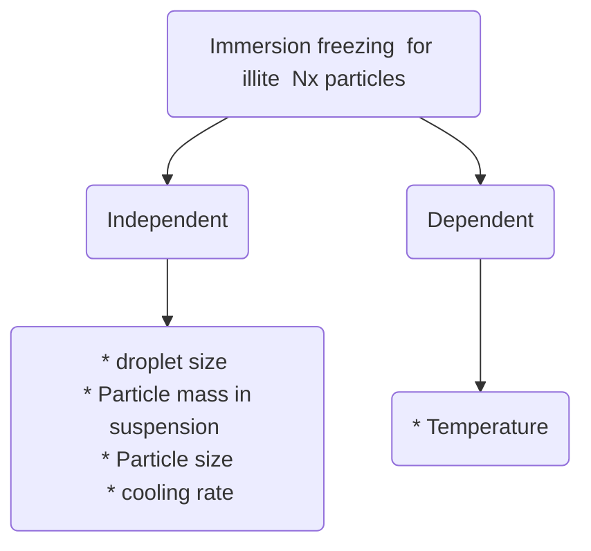

#  on the immersion freezing behavior of illite NX particles: a comparison of 17 ice nucleation measurement techniques

# Reference 
@article{hiranuma2015comprehensive,
  title={A comprehensive laboratory study on the immersion freezing behavior of illite NX particles: a comparison of 17 ice nucleation measurement techniques},
  author={Hiranuma, Naruki and Augustin-Bauditz, Stefanie and Bingemer, Heinz and Budke, Carsten and Curtius, Joachim and Danielczok, Anja and Diehl, Karoline and Dreischmeier, Katharina and Ebert, Martin and Frank, Fabian and others},
  journal={Atmospheric Chemistry and Physics},
  volume={15},
  number={5},
  pages={2489--2518},
  year={2015},
  publisher={Copernicus GmbH}
}

# Abstract

There is challenge in understanding how ice nucelation results are potentially influenced or biased by experimental parameters associated wiht different techniques

IN data as function of: 
										* Particle concentration
										* Temperature
										* Cooling rate
										* Nucleation time
										
The dataset was evaluated using the inas density ( #inas )

* In general, **17** techniques deviate within a range of 8°C and by **3 orders** of magnitude with respect to $n_s$ 

( #illite, #particle_size , #cooling_rate, #droplet_size)

* Measurement techniques have proven change the IN activity and the temperature at which nucleates. For instance, **wet techniques** have shown to **promote** nucleation at **higher temperatures** 

# 4.2 Limitations of instrument types

Possible systematic uncertainties in the estimation of $n_s$ ( #limitations, #instruments)
* Particle generation
* Particle size-segregation
* Total surface area estimation ( #surface_area )
* Ice crystal detection or counting
* Ice crystal detection size limits for OPC ( #OPC) or CCD ( #CCD)
* Particle loss at the inlet and/or in the chamber