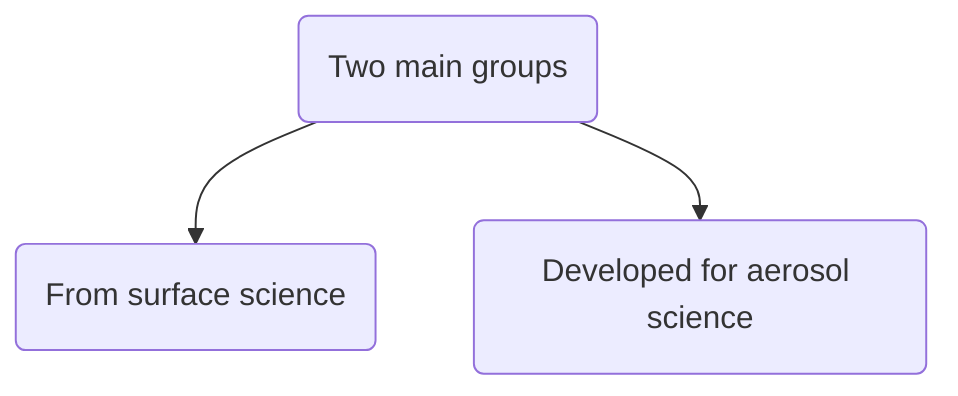

# Immersed in Supercooled Cloud Droplets

# Reference
@article{murray2012ice,
  title={Ice nucleation by particles immersed in supercooled cloud droplets},
  author={Murray, BJ and O'sullivan, D and Atkinson, JD and Webb, ME},
  journal={Chemical Society Reviews},
  volume={41},
  number={19},
  pages={6519--6554},
  year={2012},
  publisher={Royal Society of Chemistry}
}

# 3. The structure of ice which nucleates and grows

Many times water goes to a metastable phase before undergoes in the stable phase (ice crystals with hexagonal structure). This is mainly due to energy barriers and favourable energetic conditions

* Out of the 15 crystalline phases of ice that are known <mark class='yellow'>only</mark> **ice I** can form at atmospheric pressure
![[ice_I.gif| Ice I, hexagonal structure]]

# Introduction of different theories

**Hygroscopic growth** Change of the diameter of a particle at elevated #RH due to #adsorption of water. It is described by the parameter $\kappa$ . For accounting for the hygroscopic growth there is one equation which takes into account the **kelvin effect** ( #kelvin_effect), <mark class='yellow'>but this is only important for small particles</mark> (particles with dry diameter lower than 100 nm)

**Discussion** Fundamental difference between adsorption theories originating from **surface** and **aerosol** science
| **Surface** | **Hygroscopic** |
|-----------|-------------------|
|Amount of water absorbed is proportional to **total surface area**| Amount of water adsorbed is proportional to **volume of solute**|
| implication: Same amount of water, what matters is the surface area| for the same size (no matter the properties of the particle) more water implies more adsorption|

