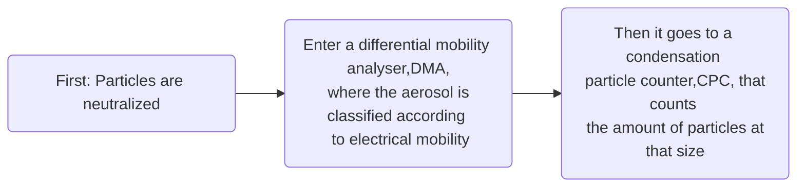

# OpticalParticleCounter : #OPC
It employs a small sensing volume, either by a focused incandescent lamp or by a laser source. It is important to avoid coincidence errors resulting from more than one particle in the sensing volume.
Most counters implement perpendicular geometry given that the dependency of the scattered intensity on the refractive index of the particle is less pronounced at 90°
![[opc.jpg]]
The amplitude of the photoelectric signal generated on the detector by the particle crossing the illuminated zone is compared with the standard calibration curve obtained from the set of known particles. The size of the particles are obtained with the scattering intensity and by using #MieTheory
**Observation** To measure aerosol size distribution but for <mark class='yellow'> larger sizes</mark> than #SMA or #APS
The size parameter is defined as
$$
\alpha = \frac{\pi D_p}{\lambda}
$$
Where $D_p$ is the diameter of scattering particle and $\lambda$ is the light wavelength
There are **3** scattering regimes:

* $\alpha << \lambda$  **Rayleigh scattering**: 
$$
I = I_0 \frac{1 + cos^2(\theta)}{2R^2}(\frac{2 \pi}{\lambda})^4(\frac{n^2-1}{n^2+2})^2(\frac{d}{2})^6
$$
* $\alpha \sim \lambda$ **Mie theory**: More complicated theory
* $\alpha >> \lambda$ **Geometric scattering**: 
$$
I = I_0 K_{n, \theta} d^2
$$
# AerodynamicParticleSizer: #APS
It is an alternative to #OPC. It is especially important when the filtration, deposition, and inhalation properties of the particle are important. It accounts for the #size, #shape,and #density of the #particles. It provides the aerodynamic diameter of the particles.
**Range** 0.5 - 20 $\mu$m 
We can relate this diameter with the equivalent diameter if we define the aerodynamic diameter as the diameter of a spherical particle that has the same setting velocity of an aspherical particle
$$
d_{ve} = \sqrt(\frac{\chi}{\rho})d_{ae}
$$
where $\chi$ is the shape factor, $\rho$ the average density of the aerosol particle, $d_{ae}$ the aerodynamic diameter and $d_{ve}$ is the volume equivalent diameter

# TunableDiodeLaser: #TDS
it works with absorption spectrosctopy and it is used for #watervapormeasurements

### #SIMONE:
It is used to measure the laser scattering and depolarization. 
The parallel and perpendicular scattering ratio (polarization regarding to the scattering plane) can be calculated with the use of #Muller matrix as follows:

$\delta_H = \frac{S_{11}-S_{22}}{S_{11} + 2S_{12}} + S_{22}$  and $\delta_v = \frac{S_{11}-S_{22}}{S_{11} - 2S_{12}} + S_{22}$

where $\delta_H$ and $\delta_v$ make reference to the parallel and perpendicular component, respectively.
It is important to notice that this is under the assumption of <mark class="red"> Isotropic material,  </mark>$\delta_{12}=\delta_{21}$

# Rotating brush generator 
Used to disperse aerosol bulk sample. Description: size range: 0.1-100 $\mu m$, fine fraction < $100 nm$ 

# Condensation Particle Counter ( #cpc) 
Used to measure the aerosol number concentration (number of aerosol per volume of air). It is a particle counter that detects aerosol particles by first enlarging them by using the particles as nucleation centers to create droplets in a supersaturated gas, where particles growth to sizes between 10-12 $\mu m$ and then counted by laser scattering.

![[cpc.jpg]] 

# Scanning Mobility Particle Sizer ( #SMPS)
Used to obtain the aerosol size distribution. Mobility of a charged particle in an electric field

**Range** 10 nm - 800 nm
the volume equivalent diameter ( spherical particle with the same volume as the measured ) can be obtained from the mobility diameter ( $d_{me}$) as follows
$$
d_{ve} = \frac{d_{me}}{\chi}
$$
Where $\chi$ is the shape factor of the aerosol

