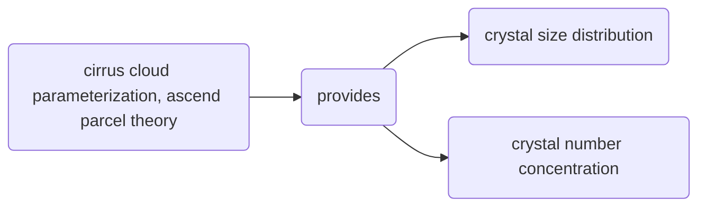

# Reference
@article{barahona2008parameterization,
  title={Parameterization of cirrus cloud formation in large-scale models: Homogeneous nucleation},
  author={Barahona, Donifan and Nenes, Athanasios},
  journal={Journal of Geophysical Research: Atmospheres},
  volume={113},
  number={D11},
  year={2008},
  publisher={Wiley Online Library}
}

# Abstract
New physically based parameterization of **cirrus** cloud formation. The parameterization is based on *ascending parcel theory* and provides expressions for the ice crystal size distribution and the crystal number concentration

This parameterization is evaluated for cirrus cloud formation conditions. Never is mentioned that other typed of clouds were considered

# Introduction

* The formation of ice crystals at relatively low supersaturations due to IN has the effect on the cloud of reducing the number concentration of ice crystals
* The *formation of cirrus clouds* is modeled by solving the *mass and energy* balances in an *ascending (cooling) cloud parcel* 

# Numerical cirrus parcel model

Homogeneous freezing is a stochastic process, meaning that droplets of the same size and composition will freeze at different times, so freezing of a perfectly monodisperse droplet population will result in a polydisperse ice crystal population.

### Formulation of equations

The derivation of the following equations are of the utmost importance given that they will be used in the following papers where the authors develop the parameterizations for the case of monodisperse chemically homogeneous and polydisperse chemically inhomogeneous heterogeneous ice nucleation nucleation.
This equations correspond to the framework of an ascending cloud parcel. Simplifications and assumptions are made with base of numerical models. They resolved the equations numerically and then some patterns and behaviors were inferred which gave place to those assumptions.
Okay, let's start with the fun.

In this context, we are interested only on homogeneous ice nucleation, hence the supercooled droplets are pure and they will freeze due to stochastic (random) effects in the regime of homogeneous nucleation (temperature and ice super saturation). This is the reason for why all simulations and validations are done fore *cirrus clouds*
In the following part, Equations 1 to 11 are introduced, these are the same as in the paper.
With these equations the parameterization is obtained. They are the regular equations for change of supersaturation (Equation 1), water mixing ratio (Equation 2), change of water mixing ratio (ratio of water deposition) (Equation 4), change of temperature (Equation 3), change of size of the ice crystal (Equation 5), change of the ice crystal and droplet distribution function (Equation 7 and 11), and finally the definition of the probability of droplet freezing (Equation 9).

$$
\begin{gathered}
\frac{d S_{i}}{d t}=-\frac{M_{a} p}{M_{w} p_{i}^{o}} \frac{d w_{i}}{d t}-\left(1+S_{i}\right)\left[\frac{\Delta H_{s} M_{w}}{R T^{2}} \frac{d T}{d t}-\frac{g M_{a}}{R T} V\right]
\end{gathered} \tag{1}
$$
$$
\frac{d T}{d t}=-\frac{g V}{c_{p}}-\frac{\Delta H_{s}}{c_{p}} \frac{d w_{i}}{d t} \tag{2}
$$
$$
w_{i}=\frac{\rho_{i}}{\rho_{a}} \frac{\pi}{6} \int_{D_{o, \text { min }}}^{D_{o, \text { max }}} \int_{D_{c, \text { min }}}^{D_{c, \text { max }}} D_{c}^{3} n_{c}\left(D_{c}, D_{o}\right) d D_{c} d D_{o} \tag{3}
$$
$$
\frac{d w_{i}}{d t}=\frac{\rho_{i}}{\rho_{a}} \frac{\pi}{2} \int_{D_{o, \text { min }}}^{D_{o, \text { max }}} \int_{D_{c, \text { min }}}^{D_{c, \text { max }}} D_{c}^{2} \frac{d D_{c}}{d t} n_{c}\left(D_{c}, D_{o}\right) d D_{c} d D_{o} \tag{4}
$$
$$
\frac{d D_{c}}{d t}=\frac{\left(S_{i}-S_{i, e q}\right)}{\Gamma_{1} D_{c}+\Gamma_{2}} \tag{5}
$$
with 
$$
\begin{aligned}
& \Gamma_{1}=\frac{\rho_{i} R T}{4 p_{i}^{o} D_{v} M_{w}}+\frac{\Delta H_{s} \rho_{i}}{4 k_{a} T}\left(\frac{\Delta H_{s} M_{w}}{R T}-1\right) \\
& \Gamma_{2}=\frac{\rho_{i} R T}{2 p_{i}^{o} M_{w}} \sqrt{\frac{2 \pi M_{w}}{R T} \frac{1}{\alpha_{d}}}
\end{aligned} \tag{6}
$$
$$
\frac{\partial n_{c}\left(D_{c}, D_{o}\right)}{\partial t}=-\frac{\partial}{\partial D_{c}}\left(n_{c}\left(D_{c}, D_{o}\right) \frac{d D_{c}}{d t}\right) \tag{7}
$$
with boundary and initial conditions given by:
$$
\begin{aligned}
& \left.\frac{\partial n_{c}\left(D_{c}, t\right)}{\partial t}\right|_{D_{c}=D_{o}}=n_{o}\left(D_{o}, t\right) \frac{\partial P_{f}\left(D_{o}, t\right)}{\partial t} \equiv \psi\left(D_{o}, t\right) \\
& n_{c}\left(D_{c}, D_{o}, 0\right)=0
\end{aligned} \tag{8}
$$
$$
P_{f}\left(D_{o}, t\right)=1-\exp \left(-\frac{\pi}{6} \int_{0}^{t} D_{o}^{3} J(t) d t\right) \tag{9}
$$
$$
\frac{\partial P_{f}\left(D_{o}, t\right)}{\partial t}=\frac{\pi}{6} D_{o}^{3} J(t) \exp \left(-\frac{\pi}{6} \int_{0}^{t} D_{o}^{3} J(t) d t\right) \tag{10}
$$
In a similar way for droplets
$$
\frac{\partial n_{o}\left(D_{o}, t\right)}{\partial t}=-\frac{\partial}{\partial D_{o}}\left(n_{o}\left(D_{o}\right) \frac{d D_{o}}{d t}\right)-\psi\left(D_{o}, t\right) \tag{11}
$$
 
with  $n_{c}\left(D_{c}, D_{o}\right)=\frac{d N_{c}\left(D_{o}\right)}{d D_{c}}$ is the ice crystal number distribution number

In Equation (2) radiative effects are neglected.
By definition the ice mixing ratio in the parcel (Amount of water vapor that was deposited to ice and now is ice divided by the amount of water vapor)

# Parameterization of Ice Nucleation and Growth

### Parameterization of $n_c(D_c,D_0)$

**Assumptions:** The following are the assumptions made in order to obtain the parameterization:
1. The crystal growth will happen only from the critical supersaturation up to the maximum supersaturation. Despite, there is still some growth (Figure 3) this is neglected in order to use what they called the "free growth".
2. Nucleation of crystals happen before maximum supersaturation ( $S_{i,max}$).

$n_c(D_c,D_0)$ is determined by a *given supersaturation with respect to ice profile* ($S_i$) by tracking back the growth of a group of ice crystal from $D_c$ to $D_0$ , Figure 3.
![[crytal_growth_homogeneous_freezing.png]]

* In a monotonically increasing $S_i$, $P_f(S_0')$ decreases with increasing $D_c$ 

# Questions.
* The paper said that the parameterization is for **cirrus clouds**, this same parameterization can be generalized to other types of clouds, e.g., *mixed phase clouds* ? 

