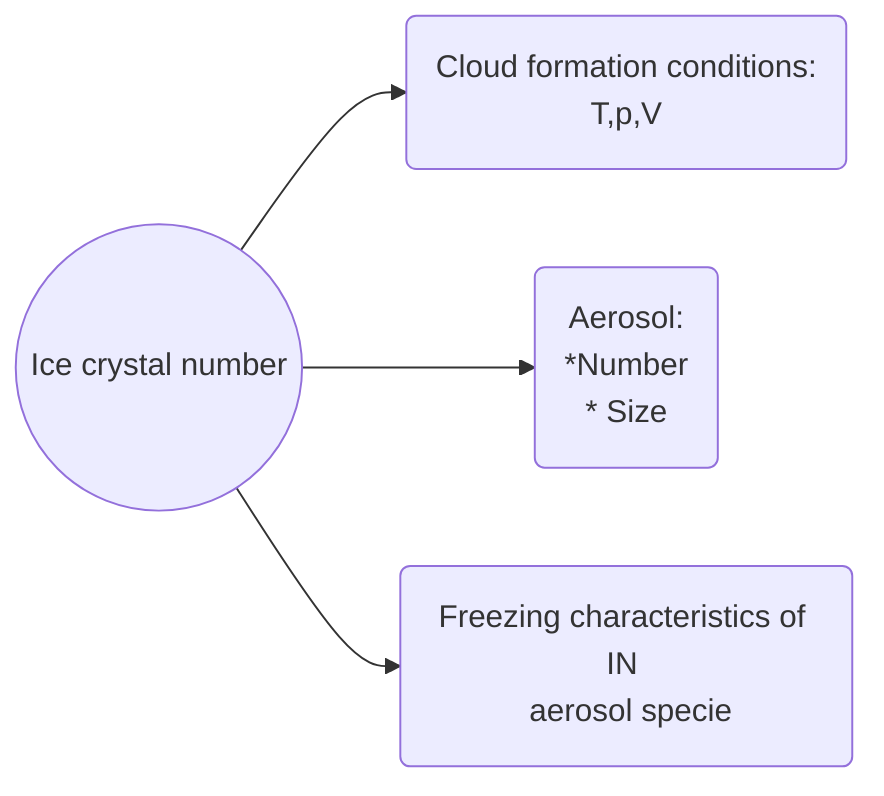
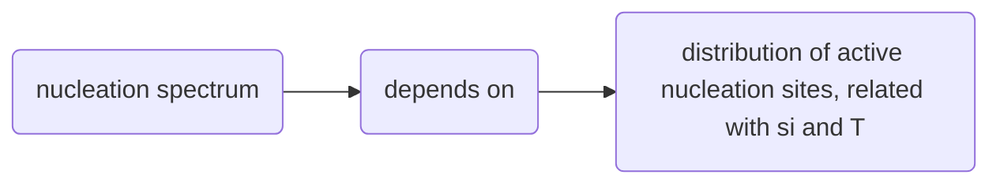
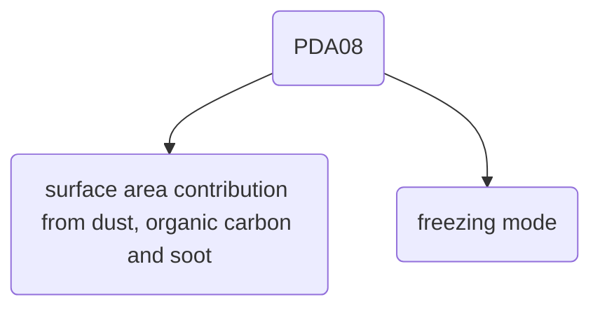
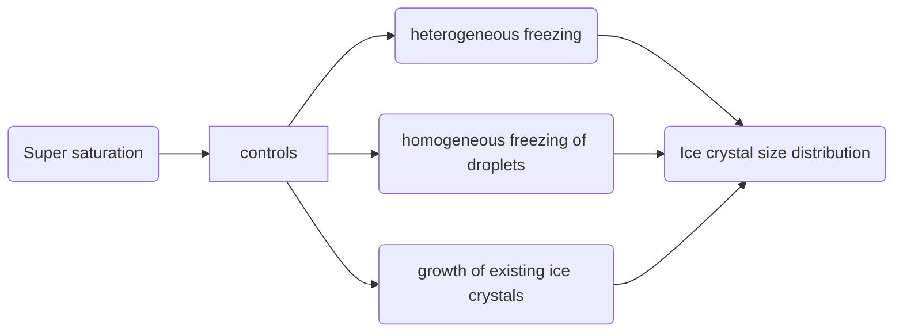
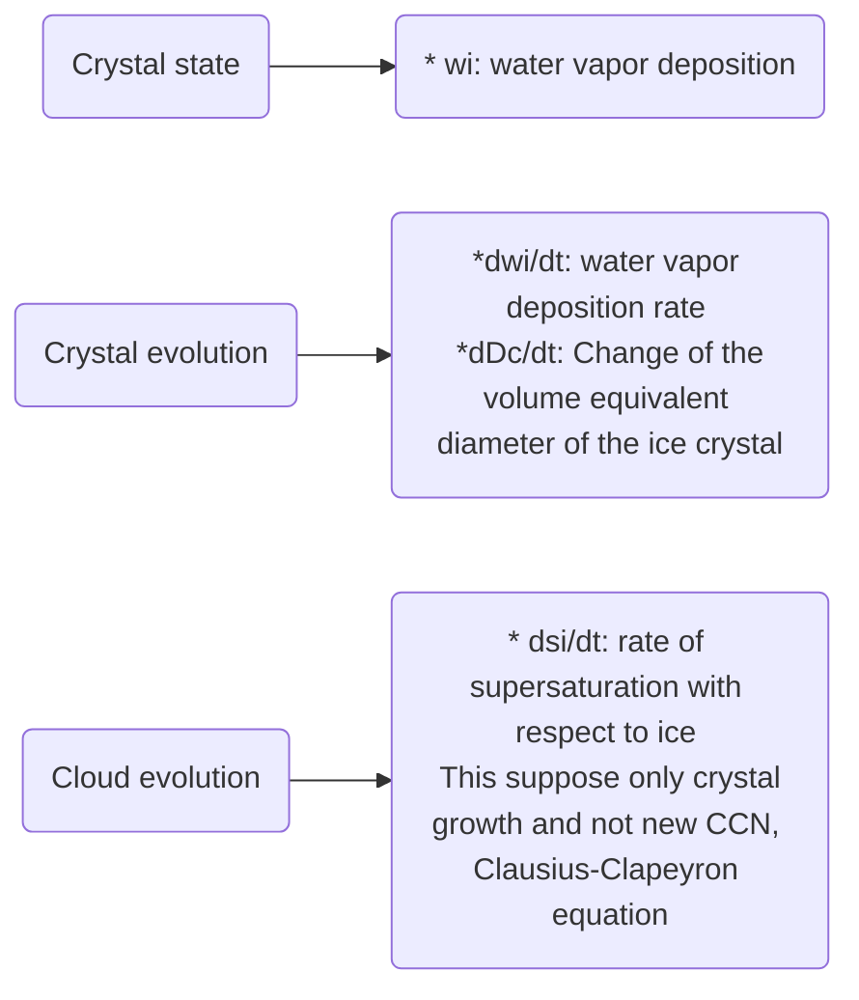
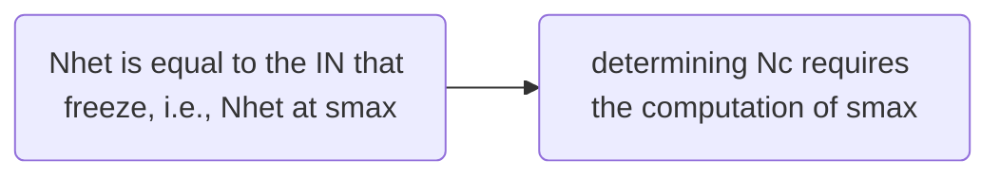

```
---  
share: true  
---  
```
# and heterogeneous freezing in ice cloud formation_polydisperse ice nuclei

# References
@article{barahona2009parameterizing,
  title={Parameterizing the competition between homogeneous and heterogeneous freezing in ice cloud formation--polydisperse ice nuclei},
  author={Barahona, D and Nenes, Athanasios},
  journal={Atmospheric Chemistry and Physics},
  volume={9},
  number={16},
  pages={5933--5948},
  year={2009},
  publisher={Copernicus Publications G{\"o}ttingen, Germany}
}

# Abstract
This study presents a comprehensive ice cloud formation parameterization that computes the ice **crystal number**, **size distribution**, and **maximum supersaturation** from precursor aerosol and ice nuclei.

The parameterization provides an **analytical solution of the cloud parcel model equations** and accounts for the **competition effects between homogeneous and heterogeneous freezing**, and, between heterogeneous freezing in different modes

# Introduction
* Empirical parameterizations are incomplete, as they provide only ice nuclei (IN) concentrations. *Calculation of ice crystal number concentration*, Nc, requires the knowledge of *cloud supersaturation* and therefore the usage of a dynamical framework.
* The new scheme allows the usage of both empirical and theoretical IN data in a simple dynamical framework, and can consider the spectral variability in aerosol and IN composition
* ==explicitly resolves the dependency of number ice cystals ($N_c$) on conditions of cloud formation (i.e., T, p, V ), *aerosol number and size*, and the freezing characteristics of the IN==



# Description of ice nucleation spectrum

* Heterogeneous freezing is different from homogeneous freezing in that it exhibits a broad range of freezing thresholds, even for aerosol of the same type
* Freezing occurs instantaneously when a threshold $s_i$ ( #Supersaturation ) and T ( #temperature ) associated with a nucleation site ( #nucleation_site) are reached; thus a distribution of active nucleation sites on the aerosol particles would result in a distribution of freezing thresholds

* At constant *T* , the aerosol freezing fraction is represented by a continuous function of $s_i$ which results from the diversity of active nucleation sites that may be available in the insoluble aerosol population. **The nucleation spectrum can be defined as**
$$
n_s(s_i,T,p,..) = \frac{\partial N_{het}(s_i,T,p,..)}{\partial s_i} \bigg\vert_{T,p,...} \tag{1}
$$

Where $n_s(s_i,T,p,..)$ is the nucleation spectrum, $N_{het}(s_i,T,p,..)$ is the crystal number concentration produced by heterogeneous freezing

**Note** the nucleation spectrum is the change of the crystal number concentration with respect to super saturation when all other variables are keep constant: temperature, concentration.

# Empirical IN spectra

A more comprehensive formulation, considering (in addition to $s_i$ and T ) the surface area contribution ( #surface_area ) from different aerosol types (i.e., dust, organic carbon, and soot) and freezing modes (i.e., deposition and #immersion_freezing immersion), was presented by Phillips et al. (2008, #PDA08). PDA08 is developed using IN and aerosol concentration measurements from several field campaigns



# IN spectra from classical nucleation theory

For *pure homogeneous freezing* the nucleation spectrum, $N_{hom}(s_i)$ can be approximated as

$$
	N_{hom}(s_i) \approx N_0 \frac{J_{hom}(s_{hom})\bar{v_0}}{\alpha V k_{hom}}\frac{1}{s_{hom} + 1 }exp[-k_{hom}(s_{hom} -s_i)] \tag{3}
$$

Where $J_{hom}$ is the freezing rate for homogeneous freezing, $s_{hom}$ is the supersaturation homogeneous freezing threshold (*above this number homogeneous freezing occurs*), $N_0$ and $\bar{v}$  are the number concentration and mean volume of the droplet population, $V$ is the updraft vertical velocity of the air parcel ( #updraft_vertical_velocity), and $k_{hom}$ is
$$
k_{hom} = (s_{hom}-s_i)ln\frac{j_{hom}(s_{hom})}{j_{hom}(s_i)}
$$
I also can account for *heterogeneous* freezing, the equations are written in this paper and I won't write them again.

# Formulation of the parameterization

The parameterization is based on the framework of an *ascending Lagrangian parcel*. At any height during the parcel ascent, supersaturation with respect to ice, $s_i$, develops and the ice crystal size distribution is determined by heterogeneous freezing of IN, homogeneous freezing of droplets, and growth of existing ice crystals


# The ice parcel equations

Considering the solution to the **Clausius-Clapeyeron equation** to describe the vapor pressure:
$$
e_s(T) = e_s(T_0)e^{\frac{L}{R_v}(\frac{1}{T_0}-\frac{1}{T})}
$$


where es $e_s(T)$ is the saturation vapor pressure, ${T_0}$ is a given temperature (usually 273 K), $L$ is the latent heat of transformation,  $T$ is temperature, and$R_v=461$ $JK^{-1}kg^{-1}$ is the gas constant for water vapor. The values for latent heat for different phase transitions are: $L_f=3,337X10^5$ $Jkg^-1$ , $L_v=2,501X10^6$ $Jkg^-1$ , $L_s=2,834X10^6$ $Jkg^-1$ , $e_s(T_0)=611.2$ $P_a$. Nevertheless, this quantities also depend on temperature and can be defined as: $L_c = 2.501 - 0.00237T \quad$,$L_{c,i} = 2.832 - 0.1936T$  in $j*kg$ 

Making a plot of this equation for water super saturation with respect to ice and water we obtain:
```python
import numpy as np
import matplotlib.pyplot as plt
T_0 = 273.15
e_s = 611.2 #pa 
L_v = 2.501*1e6 # j/Kg to water
L_f = 2.834*1e6 # j/Kg to ice
R_v = 461 #J/ K kg
T = np.arange(250,285,1)
exp_v = np.exp( (L_v/R_v)*((1/T_0) - (1/T)))
exp_f = np.exp( (L_f/R_v)*((1/T_0) - (1/T)))

e_v = e_s*exp_v
e_f = e_s*exp_f

plt.vlines(273.15,0,1400)
plt.plot(T,e_v,label='water')
plt.plot(T,e_f,label='ice')
plt.ylabel('Super Saturation (Pa)')
plt.xlabel('Temperature (K)')
plt.legend()
plt.grid()
plt.show()

```

You can see that the super saturation with respect to ice is lower that to water for temperatures lower than 273.15 K

In the initial stages of cloud formation $s_i$ increases monotonically due to cooling from expansion; growth of crystals, frozen either homogeneously or heterogeneously, increasingly depletes water vapor, up to some level where $s_i$  reaches a maximum, smax.

*Interpretation:* There are two phenomena competing:
	1. Increase of supersaturation due to cooling
	2. Decrease of supersaturation due to ice crystal growth 
Until certain point, this competition will be win by the increase of supersaturation, the maximum reached value is named $s_{max}$. Then supersaturation will decrease given that crystal will continue growing.

The main parameter of interest resulting from the solution of Eqs. (7) to (9) is the ice crystal number concentration, $N_c=N_{hom} + N_{het}$. $N_{het}$ is equal to the IN that freeze, i.e., $N_{het}$ at $s_{max}$ 

In the following Image it is possible to observe the variables and dynamics involved in the interaction cloud-aerosol, when the aerosol behaves as IN and evolves over time
![[cloud_state_barahona.PNG]]
the cloud is described by the amount of water vapor deposition on the ice crystal ( $w_i$), and the supersaturation ($s_i$), its evolution is given by the change of supersaturation with respect to ice ($ds_i/dt$) and the rate of water vapor deposition on the ice crystals ($dw_i/dt$). Additionally, the ice crystal will grow ($dD_c/dt$) 



The coupled system of equations that describe this are:
$$\begin{aligned}
w_{i}(t)= & \frac{\rho_{i}}{\rho_{a}} \frac{\pi}{6} \int_{X} D_{c}^{3} n_{c}\left(D_{c}, D_{\mathrm{IN}}, m_{1, \ldots, n x}, t\right) d D_{c} d D_{\mathrm{IN}} d m_{1, \ldots, n x}
\end{aligned} \tag{6} $$
$$\frac{d s_{i}}{d t}=\alpha V\left(1+s_{i}\right)-\beta \frac{d w_{i}}{d t} \tag{7}$$
$$\frac{d w_{i}}{d t}=\frac{\rho_{i}}{\rho_{a}} \frac{\pi}{2} \int D_{c}^{2} \frac{d D_{c}}{d t} n_{c}\left(D_{c}, D_{\mathrm{IN}}, m_{1, \ldots, n x}, t\right) d D_{c} d D_{\mathrm{IN}} d m_{1, \ldots, n x} \tag{8}$$
$$\frac{d D_{c}}{d t}=\frac{s_{i}}{\Gamma_{1} D_{c}+\Gamma_{2}} \tag{9}$$
Where $m_{1,...,nx}$ collectively represents the mass fractions of the nx chemical species present in the aerosol population.
$n_{c}\left(D_{c}, D_{\mathrm{IN}}, m_{1, \ldots, n x}, t\right)$ is the number distribution of the ice crystals. In order to obtain the solution for Equations 6-9 we need to know $n_c$.


From Equation (1) you can see this dependency
$$
\int_{s_{char}}^{s_{max}}n_s(s_i,T,p,..)\partial s_i = N_{het}(s_i,T,p,..) \bigg\vert_{T,p,...} 
$$

# Determining smax and Nhet


In order to determine $s_{max}$ and then $N_{het}$ the authors do some assumptions:

**1.** Assuming negligible non-continuum effects of mass transfer:  $\Gamma_1 >> \Gamma_2$   
**2.** Assuming that the ice crystal growth is much bigger than the inicial ice nuclei diameter:
$\frac{2}{\Gamma_1}\int_{s_0'}^{s_i}\frac{s_i'ds'}{ds'/dt}>>D_{IN}^2$ . It has been found ice crystals with $D_c>20 \mu m$ and typically $D_{IN}\approx 1 \mu m$ 
**3.** Assuming that $s_{max}$ is larger enough, the limiting factor in ice crystal growth is the water vapor mass transfer. 
**4.** Assuming that a polydispers, chemically inhomogeneous IN population can be thought as a monodisperse, cehmically-homogeneous IN population in which all IN population freezes at a characteristic supersaturation $s_{char}$  

Analyzing Equation 10:
$$D_{c}\left(t, s_{i}\right)=\left(D_{\mathrm{IN}}^{2}+\frac{1}{\Gamma_{1}} \int_{s_{o}^{\prime}}^{s_{i}} \frac{s}{d s / d t} d s\right)^{1 / 2} \tag{10}$$
applying assumption **2.**
$$D_{c}\left(t, s_{i}\right)= \left( \frac{1}{\Gamma_{1}} \int_{s_{o}^{\prime}}^{s_{i}} \frac{s}{d s / d t} d s\right)^{1 / 2} $$
And using assumption **3.** we can see that the left side of equation tell us that $D_c$ depends on time ($t$) and supersaturation with respect to ice ($s_i$), but we already assumed that supersaturation is large enough that this variable doesn't influece the result. Hence, the time dependece has to be contained in the integral, its limits. Under this assumption: $s_i$ can be evaluated anywhere because $s_{max}$ is large, $D_c$ can be written as
$$
D_c(t,s_i) \approx D_c(s_i-s_0') \tag{11}
$$

Considering the interpretation of Equation (1) and $n_cdD_cdD_{IN}dm_{i,...,nx}$, and Equation (11) we can express Equation (6) as:
$$
\begin{aligned}
w_{i}\left(s_{i}\right) & =\frac{\pi}{6} \frac{\rho_{i}}{\rho_{a}} \int_{0}^{s_{i}} D_{c}^{3}\left(s_{i}-s_{o}^{\prime}\right) n_{s}\left(s_{o}^{\prime}\right) d s_{o}^{\prime} \\
& =\frac{\pi}{6} \frac{\rho_{i}}{\rho_{a}}\left[D_{c}^{3} \otimes n_{s}\right]\left(s_{i}\right)
\end{aligned} \tag{12}
$$
Where the limits of integration are from zero to $s_i$, all the range. Where $\otimes$ represents the half-convolution. 
*Intepretation* If we consider $D_c$ as the function response and $n_s$ as the input function. The amount of water vapor over the particles at certain super saturation is equal to the volume of the ice crystal ($D_c^3$) and the ice crystal number concentration adding all the contributions from zero up to that super saturation.([conv interptretation](https://betterexplained.com/articles/intuitive-convolution/)) .

Using assumption 4,  and considering Equation (7) and equating to zero, to find $s_{max}$ (the maximum residence time and hence the maximum growth), the convolution can be expressed as:
$$
\begin{aligned}
& \int_0^{s_{max}}D_c(s_{max}-s_0')n(s_0')ds_0' = N_{het}\int_0^{s_{max}}D_c(S_{max}-s_0')\delta(s_0'-s_{char})ds_0' \\
&[D_C \otimes n_s](s_{max}) = N_{het}D_c(S_{max}-s_{char}) \\
&[D_C \otimes n_s](s_{max}) = N_{het}D_c(\Delta s_{char})
\end{aligned}
$$


**OBSERVATION** Given assumption **2.** if we want to apply the same scheme to our large size ice nuclei, we have to make sure that the final ice crystal size is larger than $40 * 20 = 800 \mu m = 0.8 mm$. Otherwise, we cannot work with this assumption 
* assumption 4 implies that it is possible to find a supersaturation at which all IN are frozen. In case of large size particles, even though this is possible, as we are dealing with biger sizes ($D_{IN}$ is large) the interaction with other variables as $w$ and $dw/dt$ is not negligible in early stages and solving only for $S_{char}$ may lead to bigger errors than in the case of smaller sizes.