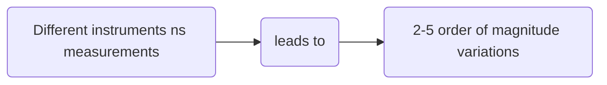

# substrate abundance explain time-dependent freezing in supercooled droplets

# Reference
@article{knopf2020stochastic,
  title={Stochastic nucleation processes and substrate abundance explain time-dependent freezing in supercooled droplets},
  author={Knopf, Daniel A and Alpert, Peter A and Zipori, Assaf and Reicher, Naama and Rudich, Yinon},
  journal={NPJ climate and atmospheric science},
  volume={3},
  number={1},
  pages={2},
  year={2020},
  publisher={Nature Publishing Group UK London}
}

# Discussion

* The larger the particles are --> themore they contribute to the observed frozen fraction ( #frozen_fraction)
* Recent INP ( #INP ) intercomparison studies of IF involving up to 17 instruments indicated 2-5 orders of magnitud variations in measured $n_s$ 

